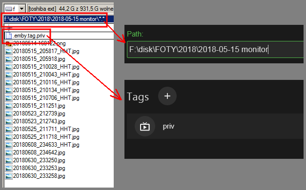

## Embian

It's main purpose was to add the ability to manage folder permissions in Emby server through filesystem.

Actually the permissions are managed through Emby's tags: Embian marks a folder with a tag which is used for blocking content (in the "parental control" tab in user's configuration).

Embian does not "hook" into Emby.
Instead it just uses Emby's public API to crawl through the whole repository and change folder's properties.
You have to manually start Embian when you want to sync tags in Emby's folders' metadata with special "tag" files in filesystem.

Actually Embian can do a bit more: it is a generic crawling routine with pluggable strategies. Currently there are two:
- apply/remove "priv" tag
- fix sortnames (see below)

### Usage

    java -jar embian-.....jar [login options] [command] [command's parameters]

The _login options_ are _host_, _username_ and _password_.
You can skip some of these provided you have a file called ".embian" in your home directory that contains these properties.
See "`man/.embian`" in the project source.

The commands are: `crawl` and `browse`.

#### `crawl` command

Crawls the Emby repository and runs item strategies given as parameters.
Every strategy optionally produces an update operation and tells the crawler if to crawl one level deeper into the hierarchy.
When all folders are visited the produced operations are executed.
The operation may be to add or remove tag or to change or reset the sort name.

##### `sortName` fixer

For my photo repo I needed to fix the sortSame assignment to have correct order of folder names
which in my case are iso dates or month of years e.g. _2018-07-14_ -> _2018-08_ -> _2018-08-06_.
Without fixing sortNames the order would be _2018-08_ -> _2018-07-14_ -> _2018-08-06_.
This is because Emby applies some to-number conversion and the default sortNames are _0000201808_, _0020180714_ and _0020180806_. 

#### `browse` command

A simple non-interactive browser. Loads and prints children of element of id given as parameter. If no id is given then all repositories are listed.

### Tech

Embian does not use official Emby client but a simple jersey-based client.

The `Main` class reads login options and the command and then creates an authenticated Emby connection and passes it to a command's class e.g. `CrawlAndCommand` or `Browse`.

The `CrawlAndCommand` first instantiates item strategies chosen by the user and runs `EmbyCrawler` with them.
The `EmbyCrawler` produces list of item operations that are executed by `CrawlAndCommand`.

Unfortunately Embian gives no extensibility besides downloading sources and modifying.

### Todos

- Trigger Emby reindex via API (Emby reindex will be triggered after ending of the backup procedure
that copies from my main storage to the backup storage which also is Emby repo)
- Trigger Embian after Emby finishes reindexing (check if reindexing is done via API)
